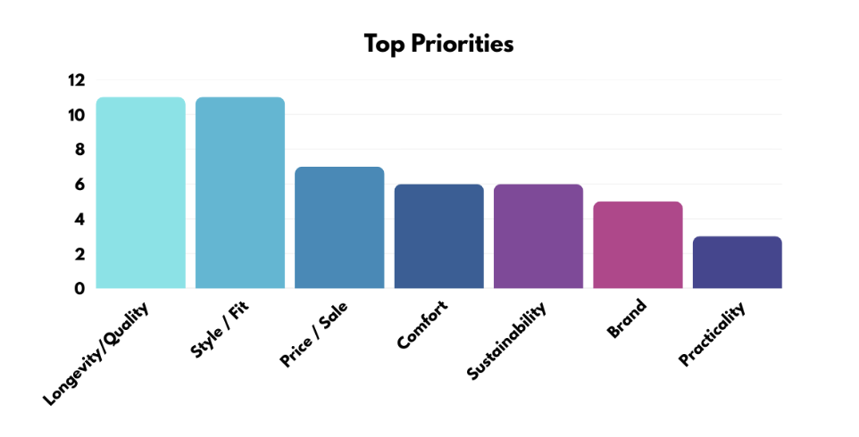
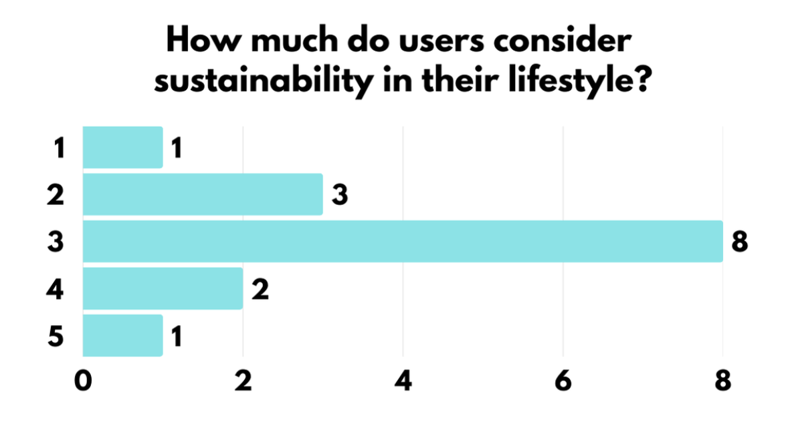
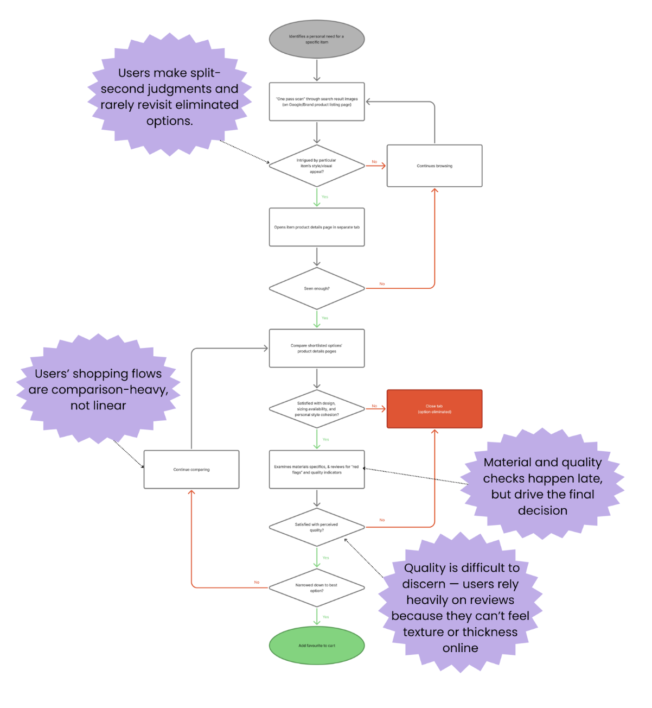
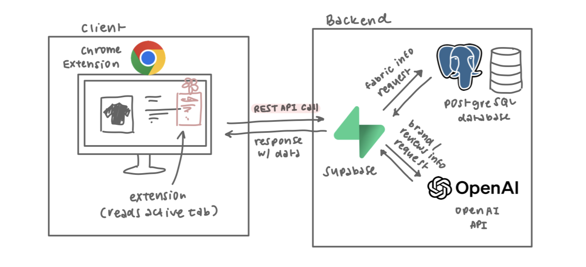
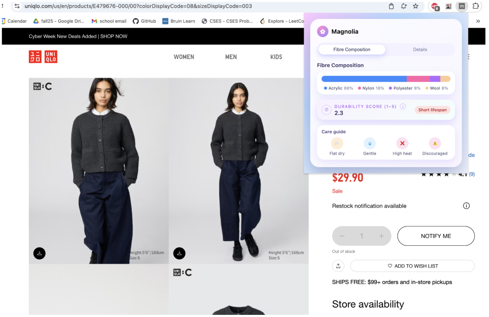
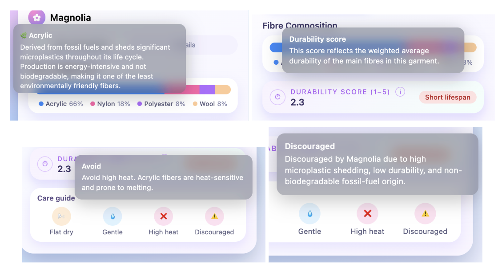
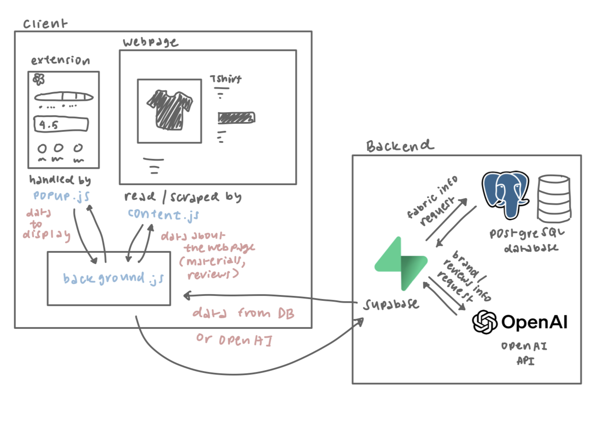
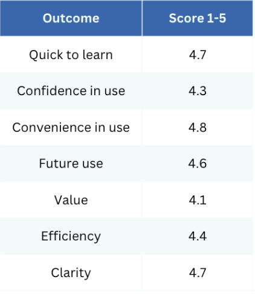
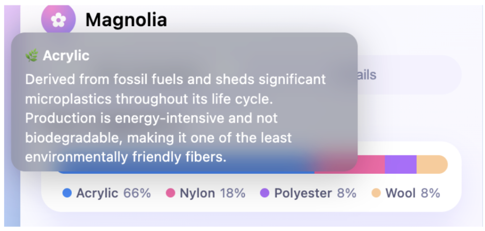

# Introduction  
## Magnolia: Designing Clarity for the Conscious Shopper  
Online shopping has never been more accessible—or more overwhelming. With thousands of garments at our fingertips, the burden of knowing what’s “good,” what will last, and what’s truly sustainable has shifted almost entirely onto consumers. For many shoppers, deciphering sustainability claims, understanding fiber compositions, or predicting durability becomes a guessing game buried beneath product descriptions and marketing labels.

Yet people *want* to shop better. They want to buy clothes that last, avoid wasteful purchases, and make environmentally thoughtful decisions—*without* spending hours researching materials or scrolling through hundreds of conflicting reviews.

**Magnolia** was born from this gap. It’s a lightweight browser extension designed to bring clarity, transparency, and simplicity into the online shopping experience. By translating fiber compositions into accessible insights on environmental impact, durability, and care difficulty, Magnolia helps users make smarter, more confident purchasing decisions at the exact moment they need support.

In this article, we walk through the research that shaped Magnolia: the interviews that revealed how people make decisions, the think-aloud studies that exposed real-time pain points, and the design principles guiding the product’s development.

## Problem Statement

Users care about buying clothes that last, and for those who value sustainability, understanding environmental impact matters too. Yet critical information about material quality, durability, and sustainability is buried, inconsistent, and hard to access—making clarity and transparency a barrier to better decision-making.

# User Research  
## User Interviews  
In this initial round of research, our goal was to understand how people incorporate sustainability into everyday decision-making and how that differs when shopping for clothes. We also sought to uncover what *other* factors—beyond sustainability—shape clothing purchases.

We conducted **15 semi-structured interviews** with participants ranging from students to working professionals, representing different levels of sustainability awareness, disposable income, and shopping habits. Across all conversations, four core themes emerged.

### 1. Longevity and Quality Are Top Decision Factors

Regardless of sustainability beliefs, *73% of users explicitly said they want clothing that lasts.*  
In fact, longevity and quality were tied with style and aesthetic as the top 2 priorities when deciding to buy a clothing item. 

Users expressed this value in many ways:

* *“If I’m spending $100, I want to wear it 100 times.”*  
* *“I want something durable, not something I’ll replace next year.”*  
* *“Quality is my biggest priority. I don’t want fast fashion that falls apart.*

Magnolia’s role, then, is to help users understand **how long a material is likely to last**, and what tradeoffs they may face.

### 2. Lack of Clarity & Transparency Erodes Trust:

Users repeatedly expressed confusion about:

* sustainability labels  
* ethical claims  
* fiber blends  
* environmentally friendly terminology  
* vague phrases like “eco-conscious” or “sustainably made”

As users struggled to interpret these terms, several voiced frustration:

* *“It’s always greenwashing. I don’t really believe most clothes are sustainable, unless you’re thrifting it.”*  
* *“Usually sustainability claims are vague or misleading.”*  
* *“If it feels heavier and stiffer, then I assume it’s better quality.”*

Because information is fragmented and unclear, users placed responsibility on themselves, Googling materials, digging through Reddit, or relying on TikTok reviews.

**This fundamental uncertainty also magnifies brand loyalty:** When transparency is low, users default to what they know.

### 3.Convenience Overrides Sustatinable Intent

Most participants expressed a desire to shop sustainably *in theory*, but convenience overwhelmingly dictated behavior *in practice*.

As participants shared:

* *I just don’t have the time as a college student. I still use Amazon because it’s so convenient.”*  
* “*I want to shop sustainably, but it takes too long to find reliable information.”*

Even self-described sustainability-conscious users admitted that:

* researching takes additional time and effort  
* ethical alternatives are harder to find  
* fast fashion is quicker and cheaper

Participants want to make responsible choices, but they are constrained by time, energy, and the emotional load of decision-making. **Magnolia must therefore reduce friction**, delivering clarity instantly without requiring extra clicks or research.

### 4. Sustainability Consciousness Varies Widely

Participants differed dramatically in how much sustainability influenced their decisions. To capture this variability, we developed a **1–5 Sustainability Consciousness Score**, grounded in interview behaviors and explicit statements:

**1 — Not considered at all**  
 Sustainability does not influence decisions; often unaware of environmental impacts.

**2 — Low awareness**  
 Recognizes sustainability but will not change behavior if inconvenient or costly.

**3 — Medium awareness**  
 Considers sustainability when possible but deprioritizes it under constraints such as price or effort.

**4 — High awareness**  
 Actively makes sustainable choices; researches materials and brand practices.

**5 — Very high awareness**  
 Deeply informed; sustainability is a primary driver in most purchasing decisions.

When asked how much sustainability they consider in their everyday life, most users rated themselves around **Level 3**—indicating moderate awareness. Many described actions like:

* bringing reusable bags  
* reducing plastic waste  
* using refillable products

At first glance, this suggests sustainability is meaningfully integrated into their lifestyle.  
 However, when we probed deeper, we uncovered an important discrepancy:

### **Lifestyle sustainability does not translate cleanly into clothing-purchase behavior.**

Even participants who diligently use reusable bags or reduce plastic consumption struggled to apply sustainability considerations when shopping for clothes.

Participants who proudly described themselves as eco-conscious in daily life—recycling diligently, carrying reusable water bottles, refusing plastic bags—*did not* apply the same degree of consideration when shopping for clothes. 

This discrepancy became one of the most important insights driving Magnolia’s design. It revealed an opportunity not to “change users’ values,” but to **remove the friction that prevents users from acting on the values they already have.**

## Think-Aloud Studies

While interviews revealed what users *say* they do, think-alouds revealed what they *actually* do.

Participants shared their screens and narrated their thoughts while online shopping, allowing us to observe real behaviors. These sessions validated our core themes and highlighted specific friction points within the typical shopping flow.

We created a user flow diagram mapping these steps and identifying the key moments in the flow.These friction points became direct opportunities for Magnolia to intervene and directly informed the design goals that follow.

# Design Goals

Magnolia’s design goals emerged directly from user research and think-aloud findings. They reflect how people actually shop.

### 1. Instant & Low Effort

Users decide within seconds whether a product is worth considering.

Therefore, Magnolia must:

* surface essential information immediately  
* avoid requiring extra clicks  
* fit naturally into the skim stage  
* reduce friction, not add to it

Convenience consistently beats sustainability—which is why our sustainability insights must feel effortless.

### 2. Reduce Cognitive Load

Online shoppers are overwhelmed. They juggle:

* reviews  
* sizing charts  
* materials  
* price comparisons  
* style considerations

Magnolia aims to simplify by converting fiber compositions into intuitive, human-centered language:

* “pills easily”  
* “long-lasting”  
* “low maintenance”  
* “avoid high heat”

By reducing mental effort, Magnolia empowers users to make clearer, more confident decisions.

### 3. Comparison-Friendly

Because users naturally:

* open many tabs  
* compare products side-by-side  
* switch constantly between windows

Magnolia must:

* maintain consistency across items  
* make cross-item comparisons easy  
* avoid interfering with users’ tab-heavy workflows

Clarity should follow the user—not make the user chase clarity.

### 4. Decision-Supportive

Magnolia must be strongest at the moment users are *about to buy*.

This is when users finally check:

* materials  
* durability  
* care difficulty  
* environmental considerations

Magnolia’s insights should confirm or challenge a user’s intuition, helping prevent regret and supporting more informed decisions.

# System Design and Implementation  
## System Overview  
Magnolia is a light-weight shopping extension that assists users in the online shopping process by accessibly providing users information on garment longevity that is otherwise difficult to find. It works by scraping the webpage for information on materials and reviews, and displaying simple and intuitive graphics on fiber composition, durability, and care instructions. It also provides users with review summaries, insights to keep in mind before buying, and information on the brand’s commitment to sustainability. Users are empowered to shop sustainably by being equipped with the necessary knowledge to shop durably.

Magnolia is a Google Chrome Extension build using HTML, CSS, and JavaScript. The backend is Supabase, a Backend-as-a-Service platform which contains our PostgreSQL database and logic for server-side OpenAI API calls.

Fig. 1 - System Diagram

## Features  

Fig. 2 - Magnolia open on a UNIQLO Listing

Upon loading a listing on a clothing retailer site, a user can open Magnolia from the extensions bar in the top right corner of Chrome. Magnolia consists of two main pages: the Fibre Composition page and the Details page. The Fibre Composition page contains three sections, showing the fibre composition breakdown of the listing, the durability score it is given, and a simple care guide based on the main materials. The Details page page contains three sections as well, showing the user review sentiment and summaries, things to note for a possible buyer, and a note on the brand’s efforts on sustainability. These pages are intentionally intuitive to use and quick to parse using simple graphics and metrics, which simplifies the process of thinking about complicated aspects.   

Fig. 3 - The Fibre Composition and Details pages

To help users make a more educated decision on their clothing, Magnolia shows users the environmental impact of the article of clothing, care tips, and recommendations/discouraging on certain products. These notes are accessible by hovering over the icons that correspond to each piece of information. 

Fig. 4 - Popup notes from mousing over hoverables

With these features, we hope that users will be able to make more informed decisions about their shopping. For example, we expect that busy college students with no access to sophisticated machines will begin to incorporate care instructions into their shopping considerations, thereby reducing waste generated from sensitive clothes ruined in laundry. By shining light on useful information that is otherwise obscured, we aim to empower users to make more sustainable decisions, even if that is not their intention, by helping them buy clothes that are long-lasting and suitable for their needs/lifestyle.

## Implementation Details

As with any extension built for Chrome, the project contains a manifest.json that contains important information about the structure and behavior of the code base. The repository consists of 3 main scripts: `popup.js`, `content.js`, and `background.js`, which all work together to show changes on the display of the extension, written in `popup.html` and `popup.css`. 

Fig. 5 - System Diagram Including Client-side Logic

### popup.js  
`popup.js` is directly included into `popup.html` as a script, and is responsible for making visual changes to the extension based on the information present on the tab. All rendering logic (i.e. inserting elements into the DOM to reflect new information) is located here. It also listens for a `DOMContentLoaded` event, on which it invokes information from the other scripts `background.js` and `content.js`. It does this by calling the [chrome.runtime](https://developer.chrome.com/docs/extensions/reference/api/runtime#method-sendMessage) API to send messages to event listeners in the other scripts. Currently, `popup.js` sends the following messages:

* `getMaterials`  
* `getCareInstructions`  
* `getDurabilityScores`  
* `getBrandInfo`

### content.js   
`content.js` is a content script, which runs in the context of web pages, and is triggered upon loading onto a page. Content scripts are able to read off the DOM, which allows Magnolia to scan for material compositions, brand, and reviews. Magnolia scrapes the materials in an article of clothing using regular expressions (regex), looking for patterns that match “\[Number\]% \[(optional) Some Words\] \[Fibre Name\]”. 

The script also matches for the DOM element containing reviews. However, there is no logic in the other two scripts that parses and displays that data currently, and will be implemented in the future.

### background.js  
`background.js` runs when any of the listeners it handles is triggered. It acts as the middleware for this extension, listening for each of the four aforementioned messages from `popup.js` and returning information that needs to be rendered back to the frontend. 

* On `getMaterials`  
  * Sends `scrapePageForMaterials` (which `content.js` is listening for)  
  * Receive a list of materials with the structure `{ percent, fiberName, baseFiber }`  
  * Return the list of materials  
* on `getCareInstructions`  
  * Using the materials gathered from the `getMaterials` event, send a `GET` request to the fabric table for the care instructions column for rows that match the `fiberName`  
  * Return a dictionary mapping `fiberName` to the care instructions fetched from the database  
* on `getDurabilityScores`  
  * Using the materials gathered from the `getMaterials` event, send a `GET` request to the fabric table for the durability column for rows that match the `fiberName`  
  * Return a dictionary mapping `fiberName` to the durability scores fetched from the database  
* on `getBrandInfo`  
  * Query the active window for the current tab’s URL and normalize it to extract the hostname  
  * Send a `GET` request to the brand table for the name and sustainability info columns for the row that match the hostname  
    * If this row doesn’t exist, send a `POST` request to the edge function (server-side logic) that prompts OpenAI API to generate a sustainability summary of the brand with that hostname  
      * Insert this into the brand database, and return the name and generated sustainability information to the client  
  * Return the full name and sustainability summary of the brand fetched from the database/backend

# Evaluation  
After creating a prototype extension, we conducted 7 usability tests. In these usability tests, we aimed to answer two questions:

* **Question 1**: Does this tool encourage people to make more sustainable purchases, and does it discourage people from buying less sustainable materials/products?   
* **Question 2**: How smoothly does the extension integrate into users’ shopping flow, and does it feel like a helpful addition or interruption?

We came up with the following metrics and analysis tools to help us answer the above questions.

Question 1: 

| Data Source | Detailed Metric/Question |
| :---- | :---- |
| System Log  | Bounce rate, exit rate after viewing data (percentage of users who leave the page after opening extension)  |
|  | Interaction patterns; (product material vs add to cart rate, time between viewing data and adding to cart to measure consideration)  |
| Survey | \[Reconsideration\] “This tool made me reconsider a purchase I would have otherwise made”  |
| Survey (System Usability Scale)  1 \- Strongly disagree 5 \- Strongly agree  | \[Confidence in tool\] “I am more confident in my ability to make sustainable clothing choices after using this tool”  |
|  | \[Sustainability\]: “This extension will encourage me to actively look for clothing made from more sustainable materials”.  |
| Interview | “Do you think that if you used this tool regularly it would change the way you prioritize sustainability in clothing?” |
|  | “What was a moment where the tool’s information made you reject an item you liked, or confirm a sustainable choice leading you to purchase the item?” |
|  | “Which piece of information (fiber composition, care summary, detail pop-up) was most influential in your decision making?  |

Question 2: 

| Data Source | Detailed Metric/Question |
| :---- | :---- |
| System Log  | Metrics of interaction patterns (pattern of use, if user immediately closes extension, does user keep tool open, how long from page load until user clicks on extension)  |
| Survey (System Usability Scale)  1 \- Strongly disagree 5 \- Strongly agree  | \[Quick to learn\]: “I feel that most people would learn to use this tool quickly” |
|  | \[Confidence in use\]: “I feel very confident in using this tool” |
|  | \[Combersome in use\]: “I found the system cumbersome to use” |
|  | \[Learning Curve\]: “I needed to learn a lot before getting started” |
|  | \[Future Use\]: “ I am inclined to use this tool in my future shopping” |
|  | \[Value\] ”The sustainability information would be highly valuable to me when making a purchase” |
|  | \[Efficiency\]: “The extension saved me time compared to finding fiber and care information manually” |
|  | \[Clarity\]: The visual representations were easy to understand at a glance |
| Interview | “Can you describe a moment where the extension interrupted your shopping flow?” |
|  | “Can you describe a moment where the extension sped up your decision making process whilst shopping?” |
|  | “How does using the extension compare to scrolling down to find the material on the retailer’s site?  |
|  | “At what point in the shopping process did you use the extension for information?  |

To apply these metrics, we conducted our usability tests as follows:

* The user was asked to navigate 2 product pages as if they were intending to buy the item, using the extension to review additional information.  
  * The interviewer is taking notes on  
    * What the user likes  
    * What the user is confused about/dislikes  
    * The user’s suggestions  
    * Any other noteworthy gestures/statements  
* The interviewer then asks the user the following questions:  
  * Do you think that if you used this tool regularly it would change the way you prioritize sustainability in clothing?  
  * What was a moment where the tool’s information made you reject an item you liked, or confirm a sustainable choice leading you to purchase the item?  
  * Which piece of information (fiber composition, care summary, detail pop-up) was most influential in your decision making?  
  * How does using the extension compare to scrolling down to find the material on the retailer’s site?  
  * At what point in the shopping process did you use the extension for information?  
  * On a scale of 1 to 5 in agreement…  
    * \[Quick to learn\]: “I feel that most people would learn to use this tool quickly”  
    * \[Confidence in use\]: “I feel very confident in using this tool”  
    * \[Combersome in use\]: “I found the system cumbersome to use”  
    * \[Learning Curve\]: “I needed to learn a lot before getting started”  
    * \[Future Use\]: “ I am inclined to use this tool in my future shopping”  
    * \[Value\] ”The sustainability information would be highly valuable to me when making a purchase”  
    * \[Efficiency\]: “The extension saved me time compared to finding fiber and care information manually”  
    * \[Clarity\]: The visual representations were easy to understand at a glance

## Results

Overall, participants from our usability testing demonstrated high ratings in the outcomes we were looking to achieve, including Convenience in use, Confidence in use and Clarity. Participants demonstrated a good understanding of our product, and was able to use the most features effectively. Our lowest ranking was for Value, which was addressed by the question for ”The sustainability information would be highly valuable to me when making a purchase”, which might suggest needing to finetune how we present sustainability information better. Furthermore, most users indicated they would likely use the durability and review sections more, which was helpful in seeing which features could be tweaked, and how to structure our information best.   

## Discussion

From our testing, we found that we hit many goals that we were aiming for. More specifically:

- Clear Alignment with Design Goals: When asking users about how well the system satisfied different parts of our design goals, all users responded positively (with average scores above 4 out of 5\)  
- Directly Addresses 4 Core Themes: All users’ user journeys suggested vast improvement in the 4 core themes. We were able to see users who did not consider environmental impact as a factor when shopping begin to evaluate the sustainability of an article of clothing using our system.  
- Integrates Well Into Shopping Flow: Users found it easy to navigate between our system and the clothing listing. They required little to no instructions and quickly adopted Magnolia into their existing shopping process.

As with any project, there were also shortcomings that left room for Magnolia to grow that we found through usability testing:

- Unclear Iconography: Users pointed out that at first glance, some icons contradicted the information that the extension displayed. For example, all materials in the fibre breakdown section have a plant icon next to their name in the popup note to signify that it is a material in clothing. However, the icon gives users a false impression that acrylic, a particularly environmentally harmful material found in clothing, is environmentally friendly. 

- Unintuitive Language: Users also pointed out that there might be some elements of language that can be tweaked. An example is under the reviews tab, having “Avoid if” gives double negative language, which might be harder to understand at first glance as opposed to “Red Flags”, or a section color coding the sentiments regarding key points reviewers have pointed out. 

Some new questions we have based on our evaluation also include: 

- Which icons would be most helpful for users to get the information they want at first glance?   
- How do we best finetune the reviews page, and how do we implement it for pages that do not have reviews? 

## Next Steps

Moving forward, there are 4 key things we want to do to improve upon our project, based on our discussion and user feedback above.

- Enable Customization: Users differed in which features they found most impactful, and engaged with different parts of the experience. Offering customization options, like rearranging modules, turning features on or off, would allow users to shape the experience around their priorities.  
- Increase scraping extensibility: A core goal of ours is to refine our scraping pipelines to support a wider range of e-commerce sites and handle variations in page formats, making data ingestion more resilient.  
- Expand fiber database: Users benefit from deeper, more accurate fiber insights. Expanding the database will increase coverage across niche fibers, blends, and alternative materials.  
- Sharpen visual language: By refining visual indicators, we can make key information easier to spot and strengthen overall skimmability, especially when users are comparing multiple options. This also includes unclear iconography and  finetuning the hovers to make our interactions more intuitive.